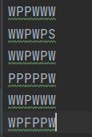
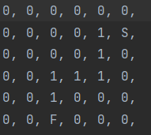
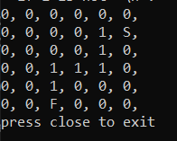

# To Run Project in Terminal
- ### If you want to run the scipt in terminal, you have to look at <a href="https://www.geeksforgeeks.org/how-to-set-up-command-prompt-for-python-in-windows10/">this link</a>.
- ### You have to write the maze properly in "girdi.txt". Don't change the name of the file.
- ### The output will shown both terminal and "cikti.txt" after the code excecuted.

# About Project
### It is an algorithm that finds the correct path from S to F point.

Start point where the user starts to try to find the F(Final) point. You have to put P(Path) between S(Start) and F(Final) point in order to user to find the exit. There have to be only one way from S to F, but you can put numbers of dead ends. You can design the maze whatever size you want. The output will give the path from S to F as 1.

#### In "girdi.txt" file, you design the maze as these characters:

- #### W --> Block
- #### S --> Start Point
- #### F --> End Point
- #### P --> Path

 

#### In "cikti.txt" file, the output will be given:
 
- #### 1 --> The only way from S to F
- #### 0 --> Blocks or dead ends

|||
|---------|---------|
| Output | Output in Terminal |

 

 
